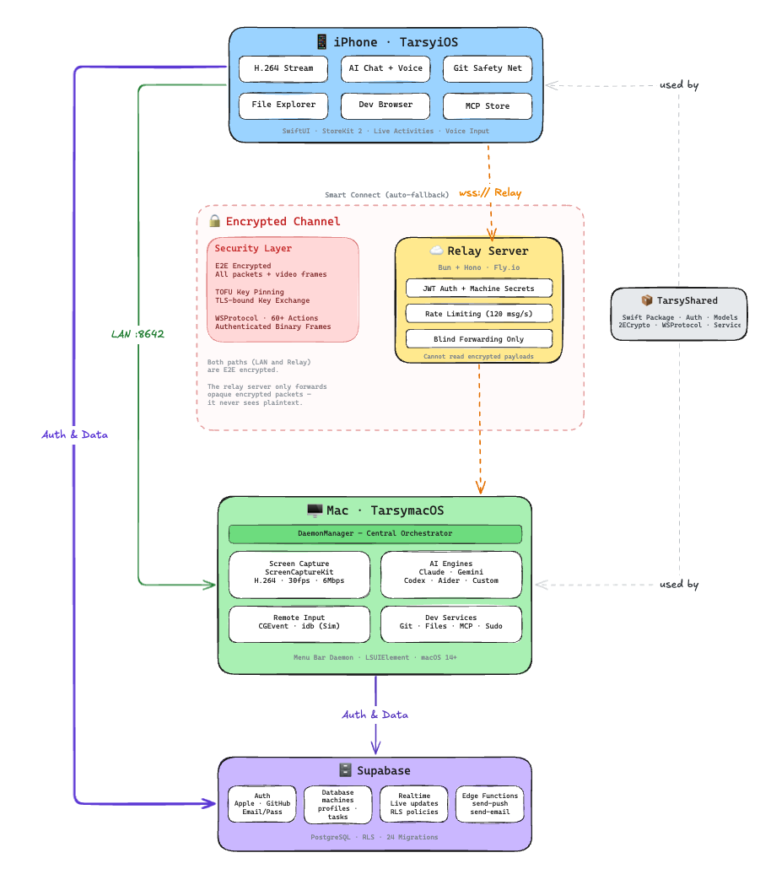

<div align="center">
  <a href="#what-is-tarsy">
    <picture>
      <source media="(prefers-color-scheme: light)" srcset="logos/logo-04-dark.png" />
      
    </picture>
  </a>
</div>

<p align="center">
  <strong>Remote desktop + AI agent control for your Mac, from your iPhone.</strong>
</p>

<p align="center">
  <a href="LICENSE"></a>
  
  
</p>

<p align="center">
  <a href="https://tarsy.dev">Website</a> &nbsp;&middot;&nbsp;
  <a href="#getting-started">Getting Started</a> &nbsp;&middot;&nbsp;
  <a href="#architecture">Architecture</a> &nbsp;&middot;&nbsp;
  <a href="CONTRIBUTING.md">Contributing</a>
</p>

---

## What is Tarsy?

You kick off an AI coding agent on your Mac, close the lid, and walk away. From your iPhone, you can see exactly what it's doing. Approve file changes, answer permission prompts, watch the screen in real-time, and course-correct when it goes off track.

No VNC. No SSH. No browser tab left open. Just your phone.

Tarsy works with **Claude Code**, **Gemini CLI**, **Codex CLI**, **Aider**, or any custom CLI agent.

## Features

| Feature | Description |
|---------|-------------|
| **Remote Desktop** | Hardware-accelerated H.264 streaming from Mac to iPhone, over LAN or relay |
| **AI Agent Control** | Send messages, answer prompts, approve permissions for any CLI agent |
| **Hot Reload** | Push SwiftUI changes to the iOS Simulator without rebuilding |
| **End-to-End Encrypted** | All packets and video frames encrypted with TOFU key pinning |
| **Smart Connect** | Auto-detects LAN, falls back to relay seamlessly |
| **Git Safety Net** | View diffs, browse history, rollback to checkpoints from your phone |
| **Live Activities** | Agent status on Lock Screen and Dynamic Island |
| **Voice Input** | Dictate to your agents in 9 languages |
| **Dev Server Preview** | In-app browser proxied through WebSocket to your running dev server |
| **File Explorer** | Browse project tree and read files remotely |
| **MCP Store** | Detect and monitor MCP integrations across all installed agents |

## Architecture

Tarsy is a monorepo with five components that work together:

<p align="center">
  
</p>

| Component | Tech | What it does |
|-----------|------|-------------|
| [`TarsyShared`](TarsyShared/) | Swift Package | Auth, networking, models, E2E crypto (shared by both apps) |
| [`TarsymacOS`](TarsymacOS/) | Swift, ScreenCaptureKit, VideoToolbox | Menu bar daemon: screen capture, remote input, AI engine management |
| [`TarsyiOS`](TarsyiOS/) | SwiftUI, AVFoundation, StoreKit 2 | iPhone app: stream viewer, AI chat, workspace management |
| [`relay`](relay/) | Bun, Hono, TypeScript | WebSocket bridge deployed on Fly.io |
| [`supabase`](supabase/) | PostgreSQL, Edge Functions | Auth, database, push notifications |

### How it connects

```
iPhone (TarsyiOS)
    │
    ├── LAN direct ──── port 8642 ──── Mac (TarsymacOS)
    │
    └── Relay ────── wss://relay ────── Mac (TarsymacOS)
                         │
                      Fly.io
```

**Smart Connect** tries LAN first (3s timeout), then falls back to relay. All traffic is end-to-end encrypted regardless of path.

## Getting Started

### Prerequisites

- macOS 14.0+, iOS 17.0+, Xcode 15+
- [XcodeGen](https://github.com/yonaskolb/XcodeGen): `brew install xcodegen`
- [Bun](https://bun.sh): needed for the relay server
- [Supabase CLI](https://supabase.com/docs/guides/cli): needed for local backend

### Quick start

```bash
# 1. Clone
git clone https://github.com/LeddoEngano/Tarsy.git
cd Tarsy

# 2. Configure (fill in your Supabase credentials and Apple team ID)
cp Tarsy.xcconfig.template Tarsy.xcconfig

# 3. Generate Xcode projects
cd TarsyiOS && xcodegen generate && cd ..
cd TarsymacOS && xcodegen generate && cd ..

# 4. Install dependencies and start relay
npm install
npm run dev:relay

# 5. Validate
./scripts/setup-check.sh
```

Then open both `.xcodeproj` files in Xcode and build.

See [CONTRIBUTING.md](CONTRIBUTING.md) for detailed setup instructions, including how to configure your own Supabase project.

## Project Structure

```
Tarsy/
├── TarsyShared/            # Swift Package, shared across apps
│   └── Sources/
│       ├── Auth/           # AuthManager (Apple, GitHub, email)
│       ├── Networking/     # ConnectionManager, WSProtocol, E2ECrypto
│       ├── Models/         # Workspace, Machine, ChatMessage, etc.
│       └── Services/       # Workspace, Machine, Chat, Profile services
├── TarsymacOS/             # macOS menu bar daemon
│   └── Sources/
│       ├── DaemonManager   # Central orchestrator
│       ├── Capture/        # ScreenCaptureKit, H264 encoder
│       ├── Input/          # Remote input dispatch
│       ├── AI/             # Engine sessions, agent detection
│       └── Networking/     # Relay client, local WebSocket server
├── TarsyiOS/               # iOS app
│   └── Sources/
│       ├── Stream/         # H264 decoder, player, interactive view
│       ├── Views/          # Dashboard, workspace, chat, settings
│       ├── Git/            # Safety net, diff viewer
│       └── Theme/          # TarsyTheme design system
├── TarsyWindows/           # Windows client (C#)
├── relay/                  # Bun + Hono WebSocket relay
├── supabase/               # Migrations, edge functions
├── website/                # Next.js landing page
└── scripts/                # Build, deploy, setup validation
```

## Key Concepts

### AI Engines

Tarsy supports multiple AI coding agents, each running as a CLI process on the Mac:

| Engine | Integration | Notes |
|--------|------------|-------|
| Claude Code | Dedicated session | Token tracking, interactive prompts |
| Gemini CLI | Generic engine | Full chat support |
| Codex CLI | Generic engine | Full chat support |
| Aider | Generic engine | Full chat support |
| Custom | Generic engine | Any CLI tool you want |

All engines conform to `AIEngineProtocol`. The macOS app auto-detects installed agents on startup via `AgentDetector`.

### WebSocket Protocol

Communication uses a custom binary packet protocol (`WSProtocol`) with 60+ action types covering:

- Workspace lifecycle, stream control, remote input
- AI agent messaging, questions, and responses
- Git operations, file browsing, dev server management
- MCP health checks, sudo handling, browser automation

### End-to-End Encryption

All packets and binary frames (including video) are encrypted using:
- ECDH key exchange bound to the TLS session
- TOFU (Trust On First Use) key pinning
- Per-packet authenticated encryption

The relay server never sees plaintext. It just forwards opaque blobs.

## Building for Distribution

```bash
# Set required env vars
export SIGN_IDENTITY="Developer ID Application: Your Name (TEAM_ID)"
export DEVELOPMENT_TEAM="YOUR_TEAM_ID"
export DEVID_PROFILE_PATH="$HOME/Library/MobileDevice/Provisioning Profiles/YOUR_PROFILE.provisionprofile"

# Build signed and notarized DMG
./scripts/build-dmg.sh
```

## Contributing

Contributions are welcome! See [CONTRIBUTING.md](CONTRIBUTING.md) for setup instructions and guidelines.

For security vulnerabilities, please see [SECURITY.md](SECURITY.md).

## License

MIT License. See [LICENSE](LICENSE).

---

<p align="center">
  Built by <a href="https://github.com/LeddoEngano">Leddo</a>
</p>
